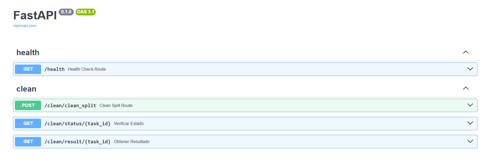
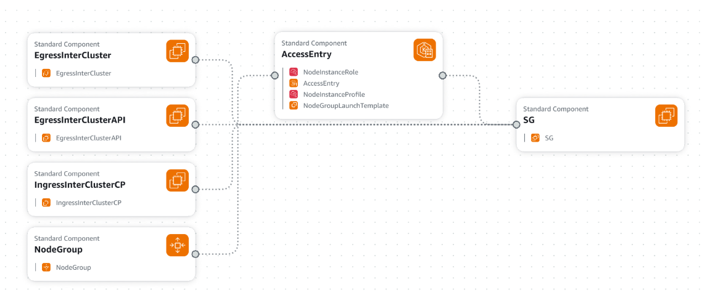
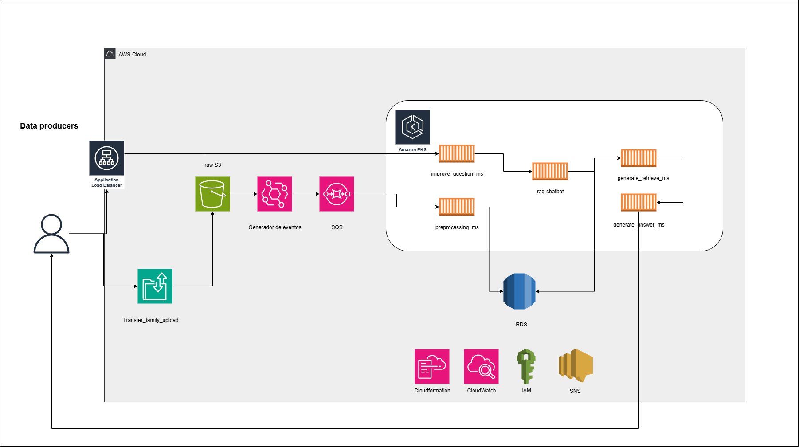
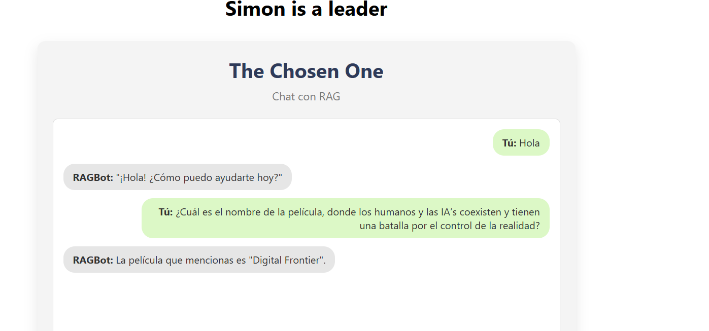

La carpeta PUNTO_2 tiene la siguiente estructura:

```
.env
.gitignore
docker-compose.yaml
pytest.ini
README.md
.pytest_cache/
    .gitignore
    CACHEDIR.TAG
    README.md
    v/
cloud_SJV_Leader/
    eks-cluster.yaml
    master.yaml
    rag-bot-sa.yaml
    secret-manager.yaml
    template-ecr.yaml
    template-iam.yaml
    template-rds.yaml
    commands/
Datical/
    queries.sql
Evidencias/
    Evidencias_infrastructura/
    Respuesta_preguntas_pdf/
    unit_test_generate_answer_ms/
    ...
generate_answer_ms/
    deployment/
        deployment.yaml
        Dockerfile
        Dockerfile.local
    Makefile
    src/
        applications/
            settings/
                container.py
        domain/
            model/
            usecase/
                __init__.py
                generate_answer/
                    generate_answer_use_case.py
        infraestructure/
            entry_points/
                fast_api/
                    handlers/
                    test_base.py
                routes/
                    generate_answer_router.py
            helpers/
                utils.py
    tests/
        unit-test/
            src/
                infraestructure/
                    entry_points/
                        fast_api/
                            test_base.py
generate_retrieve_ms/
    deployment/
        deployment.yaml
        Dockerfile
        Dockerfile.local
    Makefile
    src/
    tests/
improve_question_ms/
    deployment/
        Dockerfile
        Dockerfile.local
    Makefile
    src/
    tests/
preprocessing_ms/
    deployment/
        Dockerfile
        Dockerfile.local
    Makefile
    src/
    tests/
rag-chatbot/
    src/
        ChatBox.jsx
```

En la carpeta **cloud_SJV_Leader** se encuentra todo lo relacionado con el despliegue de la solución en AWS. El despliegue del clúster de Kubernetes y del node group se realizó utilizando eksctl, una herramienta de AWS (similar a CLI o CDK) para la gestión de infraestructura. El archivo eks-cluster.yaml contiene la configuración del clúster, incluyendo el nombre y tipo de instancia. Para que el clúster de EKS tenga acceso a los secretos, se utiliza rag-bot-sa.yaml, donde se crea un service account específico para EKS. Los comandos necesarios para aplicar estos manifiestos se encuentran en la carpeta commands.

El despliegue de la infraestructura se orquesta mediante un stack principal (master.yaml), responsable de coordinar el despliegue de los siguientes servicios:

- Secret Manager (secret-manager.yaml)
- ECR (template-ecr.yaml)
- IAM (template-iam.yaml)
- RDS (template-rds.yaml)
Toda esta infraestructura fue desplegada utilizando CloudFormation en mi cuenta de AWS.
**Nota:** Como buena práctica, todos los recursos comienzan con la letra r para identificarlos fácilmente, y los parámetros inician con la letra p.

- **Datical:** En esta carpeta se encuentra toda la configuración de base de datos, se debe de correr después de la base de datos este creada.

# Microservicios: 
- **generate_answer_ms:** Este microservicio es el encargado de generar la respuesta para el usuario al final del RAG. En su interior puede encontrar carpetas como:
- deployment: Contiene el Dockerfile y deployment.yaml estos contienen la cofiguración para la creación de los pods. Adicionalmente, para probar en local hay un Dockerfile.local.
- src: Contiene toda la lógica del micro, todo esta en arquitectura limpia (dividido en applicación, dominio e infrastructura).
- tests: Contiene todas las pruebas del microservicio. Las unit test estan hechas con pytest, por lo que encontraras un conftest.py con algunas configuraciones para su ejecución.
- Archivos de ejecución: Encontrarás un makefile con alguna configuraciones para correr el micro en local (run_local), para instalar las librerías (install_local), para lanzar las unit test en local (test_local), para lanzar docker (docker_build,docker_start). Adicionalmente, encontraras los requirements.txt -dev instala las librerías para pruebas y para desarrollo, requirements.txt instala solo las librerías de desarrollo.
- Endpoints: Puede encontrar la documentación de los endpoints aquí: http://a41eac32677e74d0585b024f6a5d478f-741200469.us-east-1.elb.amazonaws.com:8003/docs (si hay un error al abrir por favor, cambia https por http al inicio de la url en el browser.)


- **generate_retrieve_ms:** Este microservicio es el encargado de recibir la pregunta mejorada del usuario para sacarle los embeddings, normalizarlos y finalmente, realizar el retrieval a la base de datos. En su interior puede encontrar carpetas como:
- deployment: Contiene el Dockerfile y deployment.yaml estos contienen la cofiguración para la creación de los pods. Adicionalmente, para probar en local hay un Dockerfile.local.
- src: Contiene toda la lógica del micro, todo esta en arquitectura limpia (dividido en applicación, dominio e infrastructura).
- tests: Contiene todas las pruebas del microservicio. Las unit test estan hechas con pytest, por lo que encontraras un conftest.py con algunas configuraciones para su ejecución.
- Archivos de ejecución: Encontrarás un makefile con alguna configuraciones para correr el micro en local (run_local), para instalar las librerías (install_local), para lanzar las unit test en local (test_local), para lanzar docker (docker_build,docker_start). Adicionalmente, encontraras los requirements.txt -dev instala las librerías para pruebas y para desarrollo, requirements.txt instala solo las librerías de desarrollo.
- Endpoints: Puede encontrar la documentación de los endpoints aquí: http://a9b64fe8aa91a4bd999ae28dae1451c3-1604131751.us-east-1.elb.amazonaws.com:8002/docs (si hay un error al abrir por favor, cambia https por http al inicio de la url en el browser.)


- **improve_question_ms:** Este microservicio es el encargado de recibir la pregunta del usuario y tiene la responsabilidad de mejorar si es una pregunta relacionada al tema o de responder que no puede ayudarle si no es un tema relacionado a la información o simplemente seguir la conversación normal, esto con el fin de no mal gastar la api de openai generando tokens e embeddings innecesarios. En su interior puede encontrar carpetas como:
- deployment: Contiene el Dockerfile y deployment.yaml estos contienen la cofiguración para la creación de los pods. Adicionalmente, para probar en local hay un Dockerfile.local.
- src: Contiene toda la lógica del micro, todo esta en arquitectura limpia (dividido en applicación, dominio e infrastructura).
- tests: Contiene todas las pruebas del microservicio. Las unit test estan hechas con pytest, por lo que encontraras un conftest.py con algunas configuraciones para su ejecución.
- Archivos de ejecución: Encontrarás un makefile con alguna configuraciones para correr el micro en local (run_local), para instalar las librerías (install_local), para lanzar las unit test en local (test_local), para lanzar docker (docker_build,docker_start). Adicionalmente, encontraras los requirements.txt -dev instala las librerías para pruebas y para desarrollo, requirements.txt instala solo las librerías de desarrollo.
- Endpoints: Puede encontrar la documentación de los endpoints aquí: http://a801dd17f9e774a8b9d5b847151edea8-810000311.us-east-1.elb.amazonaws.com:8001/docs#/ (si hay un error al abrir por favor, cambia https por http al inicio de la url en el browser.)


- **preprocessing_ms:** Este microservicio es el encargado de recibir el documento que se va a cargar a la base de datos vectorial. Por dentro hace un proceso de limpieza de la infromación por medio de regex, luego hace un split de la información para subir todo de forma paralelizada a la base de datos, con esta optimización la infromación sube en 3 min y medio, comparado con el comienzo que se demoraba 25 min sin esta optimización de subir por lotes. En su interior puede encontrar carpetas como:
- deployment: Contiene el Dockerfile y deployment.yaml estos contienen la cofiguración para la creación de los pods. Adicionalmente, para probar en local hay un Dockerfile.local.
- src: Contiene toda la lógica del micro, todo esta en arquitectura limpia (dividido en applicación, dominio e infrastructura).
- tests: Contiene todas las pruebas del microservicio. Las unit test estan hechas con pytest, por lo que encontraras un conftest.py con algunas configuraciones para su ejecución.
- Archivos de ejecución: Encontrarás un makefile con alguna configuraciones para correr el micro en local (run_local), para instalar las librerías (install_local), para lanzar las unit test en local (test_local), para lanzar docker (docker_build,docker_start). Adicionalmente, encontraras los requirements.txt -dev instala las librerías para pruebas y para desarrollo, requirements.txt instala solo las librerías de desarrollo.
- Endpoints: Puede encontrar la documentación de los endpoints aquí: http://aaeb4e540d1d64e33bb7363644ee8f7d-548615679.us-east-1.elb.amazonaws.com:8000/docs  (si hay un error al abrir por favor, cambia https por http al inicio de la url en el browser.)



- **rag-chatbot:** Este microservicio contiene la interfaz gráfica para que el usuario interactue con el sistema RAG, además de eso también es orquestador, es decir es el encargado de realizar el workflow, recibir la pregunta, enviarsela a improve_question_ms, dependiendo del tag (si es una respuesta real o es una interacción diferente). Si es una respuesta real entonces envía la pregunta mejorada a generate_retrieve_ms, luego a generate_answer_ms y finalmente muestra la respuesta. Si no es una pregunta real (otro tipo de interacción), solo muestra en pantalla al respuesta del LLM de improve_question_ms. Este microservicio el front esta hecho en react y tiene un backend en expressJS.
- deployment: Contiene el Dockerfile y deployment.yaml estos contienen la cofiguración para la creación de los pods.
- Endpoints: Puede acceder a la aplicación aquí: http://a012e64c768914815a966b17d908e85f-727706847.us-east-1.elb.amazonaws.com:3000/docs  (si hay un error al abrir por favor, cambia https por http al inicio de la url en el browser.)

**Nota:** Todo el sistema tiene un sistema de alertamiento de errores (SNS) que envia a mi correo cada vez que hay un error. 


# Cobertura de pruebas
Se llevaron acabo pruebas unitarias con pytest, además de usar mock para simular servicios como openai, la base de datos postgres y el sistema de alertamiento de errores SNS todas con una cobertura superior al 90%,

- Unit test generate answer ms:

- Unit test generate retrieve ms:

- Unit test improve question ms:

- Unit test preprocessing ms:


# Infrastructura de AWS:
- Infra eks:


- Infra Node Group:


- Infra RAG:


La infrastructura para este ejercicio se basó en contenedores todo con eks, tenemos un orquestador que sería el microservicio de rag-chatbot, este básicamente se encarga de orquestar los post a los diferentes endpoints. Primero el microservicio de improve_question_ms recibe la pregunta, realiza un taggeado, es decir, define si la pregunta es una pregunta real o simplemente el usuario esta saludando o pidiendo una información fuera del scope, si es un saludo o una conversación casual el LLM de improve question envia la respuesta directamente a rag-chatbot y será la que se muestre en la interfaz gráfica. Si es una pregunta relacionada con los temas o la información de nuestro rag entonces el micro de improve_question la taggea como real y la regresa a rag-chatbot para hacerle el post a generate_retrieve_ms y hacer un retrieval de top 3 y finalmente, la respuesta vuelve a rag-chatbot que envia la últiam petición a generate_answer_ms para generar la respuesta que se mostrara en la interfaz.

La interfaz tiene un front creado en React y un back en un servidor de experssJS.


# Buenas prácticas:
- Se usa JWT para la comunicación entre los microservicios, todo esto se envia por medio del header-
- Se usa Secret Manger para custodiar todos los secretos de la base de datos, el secreto de openai y tokens de la solución.
- Health check endpoint en los microservicios para verificar si están arriba.
- Separación de infrastructura (Despliegue por un main.)
- Partición de archivos para carga a base de datos. 
- Implementación de Clean Architecture.
- Se usa PEP 8 para la escritura del código (Facilidad en la lectura.)
- Documentación de las funciones.
- Alertamiento de errores automática (SNS)
- Separación de Dockerfile (PDN y .local)
- Centralización de imágenes docker con ECR
- Documentación para usuarios. Además de agregar Docker-compose para correr en su local, lo único que tienes que hacer es agregar las credenciales de AWS en el archivo .env en el root del proyecto y lanzar el docker compose. 
- No se expone la aplicación directamente sino que se hace por medio de un balanceador de cargas.
- Normalización de embeddings como se usa una dsitancia de coseno, esta funciona mejor con los vectores normalizados.

# Trabajo futuro:

Por términos de tiempo hay algunas implementaciones que me hubiera gustado hacer pero no pude. 
- En el microservicio de preprocessing_ms, me gustaría que este escuche de una cola de SQS, debido a que este microservicio es asíncrono podría subir varios archivos al tiempo de diferentes eventos. 

Como se puede ver en la arquitectura propongo tener un transfer family para subir los archivos a un bucket de S3 (Raw S3), este a su vez realiza un trigger para que event bridge envie un mensaje a la cola SQS (el mensaje contien la ruta del nuevo archivo recién subido a s3) y finalmente el microservicio hace un poll a la sqs y ese micro tendría KEDA para que escale según el número de mensajes en la cola.
- Utilizar Dynatrace para el monitoreo en todos los microservicios. 
- El micro de preprocessing_ms tiene dos rutas de get_status y get_result, básicamente por se asíncrono el devuelve el id de la transacción, me gustaría adicionarle una auditoría con una base de datos o una dynamo y actualizar la trasacción si falla o si es exitosa.

# Inteligencia Artificial:
- En mi local hice la prueba agregando un rerank antes de devolver la respuesta final y la respuesta fue buena, sin embargo, en esta versión no lo vas a encontrar pues no hacía mucha diferencia. Como mi retrieval es un top 3 y tiene bastante accuracy, el rerank no tenía mucho sentido.
- Hice la prueba generando los embeddings con text-embedding-3-small que tiene una dimensión de 1536, sin embargo, con este el sistema se equivocaba contestando preguntas sobre películas semejantes. Así que decidí usar text-embedding-3-large que tiene una dimensión de 3072 y la respuesta mejoró bastante por la calidad de los embeddings.