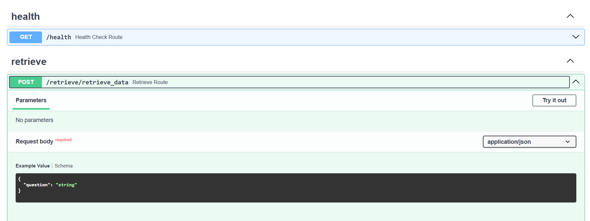
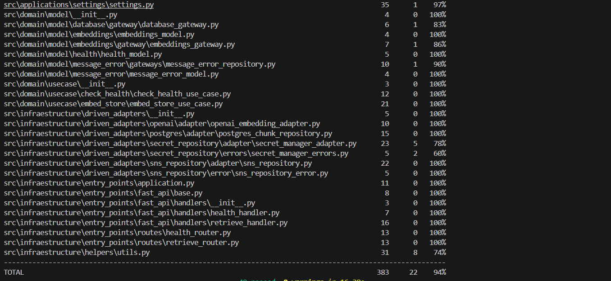
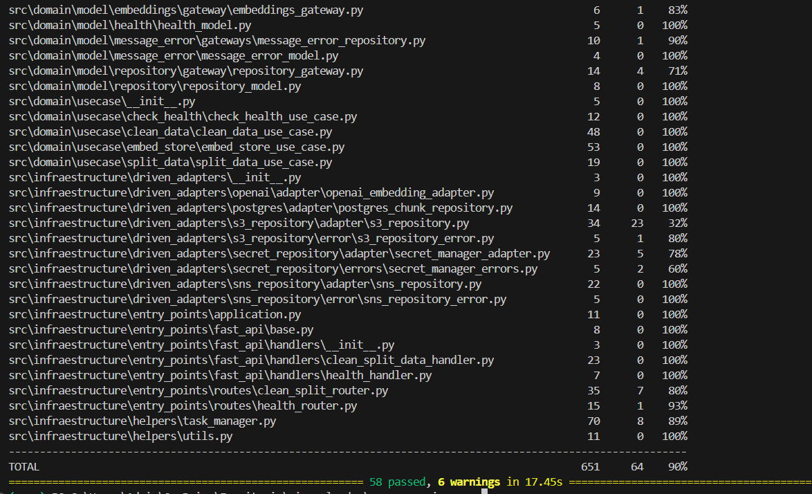

La carpeta PUNTO_2 tiene la siguiente estructura:

```
.env
.gitignore
docker-compose.yaml
pytest.ini
README.md
.pytest_cache/
    .gitignore
    CACHEDIR.TAG
    README.md
    v/
cloud_SJV_Leader/
    eks-cluster.yaml
    master.yaml
    rag-bot-sa.yaml
    secret-manager.yaml
    template-ecr.yaml
    template-iam.yaml
    template-rds.yaml
    commands/
Datical/
    queries.sql
Evidencias/
    Evidencias_infrastructura/
    Respuesta_preguntas_pdf/
    unit_test_generate_answer_ms/
    ...
generate_answer_ms/
    deployment/
        deployment.yaml
        Dockerfile
        Dockerfile.local
    Makefile
    src/
        applications/
            settings/
                container.py
        domain/
            model/
            usecase/
                __init__.py
                generate_answer/
                    generate_answer_use_case.py
        infraestructure/
            entry_points/
                fast_api/
                    handlers/
                    test_base.py
                routes/
                    generate_answer_router.py
            helpers/
                utils.py
    tests/
        unit-test/
            src/
                infraestructure/
                    entry_points/
                        fast_api/
                            test_base.py
generate_retrieve_ms/
    deployment/
        deployment.yaml
        Dockerfile
        Dockerfile.local
    Makefile
    src/
    tests/
improve_question_ms/
    deployment/
        Dockerfile
        Dockerfile.local
    Makefile
    src/
    tests/
preprocessing_ms/
    deployment/
        Dockerfile
        Dockerfile.local
    Makefile
    src/
    tests/
rag-chatbot/
    src/
        ChatBox.jsx
```

En la carpeta **cloud_SJV_Leader** se encuentra todo lo relacionado con el despliegue de la solución en AWS. El despliegue del clúster de Kubernetes y del node group se realizó utilizando eksctl, una herramienta de AWS (similar a CLI o CDK) para la gestión de infraestructura. El archivo eks-cluster.yaml contiene la configuración del clúster, incluyendo el nombre y tipo de instancia. Para que el clúster de EKS tenga acceso a los secretos, se utiliza rag-bot-sa.yaml, donde se crea un service account específico para EKS. Los comandos necesarios para aplicar estos manifiestos se encuentran en la carpeta commands.

El despliegue de la infraestructura se orquesta mediante un stack principal (master.yaml), responsable de coordinar el despliegue de los siguientes servicios:

- Secret Manager (secret-manager.yaml)
- ECR (template-ecr.yaml)
- IAM (template-iam.yaml)
- RDS (template-rds.yaml)
Toda esta infraestructura fue desplegada utilizando CloudFormation en mi cuenta de AWS.
**Nota:** Como buena práctica, todos los recursos comienzan con la letra r para identificarlos fácilmente, y los parámetros inician con la letra p.

- **Datical:** En esta carpeta se encuentra toda la configuración de base de datos, se debe de correr después de la base de datos este creada.

# Microservicios: 
- **generate_answer_ms:** Este microservicio es el encargado de generar la respuesta para el usuario al final del RAG. En su interior puede encontrar carpetas como:
- deployment: Contiene el Dockerfile y deployment.yaml estos contienen la cofiguración para la creación de los pods. Adicionalmente, para probar en local hay un Dockerfile.local.
- src: Contiene toda la lógica del micro, todo esta en arquitectura limpia (dividido en applicación, dominio e infrastructura).
- tests: Contiene todas las pruebas del microservicio. Las unit test estan hechas con pytest, por lo que encontraras un conftest.py con algunas configuraciones para su ejecución.
- Archivos de ejecución: Encontrarás un makefile con alguna configuraciones para correr el micro en local (run_local), para instalar las librerías (install_local), para lanzar las unit test en local (test_local), para lanzar docker (docker_build,docker_start). Adicionalmente, encontraras los requirements.txt -dev instala las librerías para pruebas y para desarrollo, requirements.txt instala solo las librerías de desarrollo.
- Endpoints: Puede encontrar la documentación de los endpoints aquí: http://a41eac32677e74d0585b024f6a5d478f-741200469.us-east-1.elb.amazonaws.com:8003/docs (si hay un error al abrir por favor, cambia https por http al inicio de la url en el browser.)


- **generate_retrieve_ms:** Este microservicio es el encargado de recibir la pregunta mejorada del usuario para sacarle los embeddings, normalizarlos y finalmente, realizar el retrieval a la base de datos. En su interior puede encontrar carpetas como:
- deployment: Contiene el Dockerfile y deployment.yaml estos contienen la cofiguración para la creación de los pods. Adicionalmente, para probar en local hay un Dockerfile.local.
- src: Contiene toda la lógica del micro, todo esta en arquitectura limpia (dividido en applicación, dominio e infrastructura).
- tests: Contiene todas las pruebas del microservicio. Las unit test estan hechas con pytest, por lo que encontraras un conftest.py con algunas configuraciones para su ejecución.
- Archivos de ejecución: Encontrarás un makefile con alguna configuraciones para correr el micro en local (run_local), para instalar las librerías (install_local), para lanzar las unit test en local (test_local), para lanzar docker (docker_build,docker_start). Adicionalmente, encontraras los requirements.txt -dev instala las librerías para pruebas y para desarrollo, requirements.txt instala solo las librerías de desarrollo.
- Endpoints: Puede encontrar la documentación de los endpoints aquí: http://a9b64fe8aa91a4bd999ae28dae1451c3-1604131751.us-east-1.elb.amazonaws.com:8002/docs (si hay un error al abrir por favor, cambia https por http al inicio de la url en el browser.)


- **improve_question_ms:** Este microservicio es el encargado de recibir la pregunta del usuario y tiene la responsabilidad de mejorar si es una pregunta relacionada al tema o de responder que no puede ayudarle si no es un tema relacionado a la información o simplemente seguir la conversación normal, esto con el fin de no mal gastar la api de openai generando tokens e embeddings innecesarios. En su interior puede encontrar carpetas como:
- deployment: Contiene el Dockerfile y deployment.yaml estos contienen la cofiguración para la creación de los pods. Adicionalmente, para probar en local hay un Dockerfile.local.
- src: Contiene toda la lógica del micro, todo esta en arquitectura limpia (dividido en applicación, dominio e infrastructura).
- tests: Contiene todas las pruebas del microservicio. Las unit test estan hechas con pytest, por lo que encontraras un conftest.py con algunas configuraciones para su ejecución.
- Archivos de ejecución: Encontrarás un makefile con alguna configuraciones para correr el micro en local (run_local), para instalar las librerías (install_local), para lanzar las unit test en local (test_local), para lanzar docker (docker_build,docker_start). Adicionalmente, encontraras los requirements.txt -dev instala las librerías para pruebas y para desarrollo, requirements.txt instala solo las librerías de desarrollo.
- Endpoints: Puede encontrar la documentación de los endpoints aquí: http://a801dd17f9e774a8b9d5b847151edea8-810000311.us-east-1.elb.amazonaws.com:8001/docs#/ (si hay un error al abrir por favor, cambia https por http al inicio de la url en el browser.)



- **preprocessing_ms:** Este microservicio es el encargado de recibir el documento que se va a cargar a la base de datos vectorial. Por dentro hace un proceso de limpieza de la infromación por medio de regex, luego hace un split de la información para subir todo de forma paralelizada a la base de datos, con esta optimización la infromación sube en 3 min y medio, comparado con el comienzo que se demoraba 25 min sin esta optimización de subir por lotes. En su interior puede encontrar carpetas como:
- deployment: Contiene el Dockerfile y deployment.yaml estos contienen la cofiguración para la creación de los pods. Adicionalmente, para probar en local hay un Dockerfile.local.
- src: Contiene toda la lógica del micro, todo esta en arquitectura limpia (dividido en applicación, dominio e infrastructura).
- tests: Contiene todas las pruebas del microservicio. Las unit test estan hechas con pytest, por lo que encontraras un conftest.py con algunas configuraciones para su ejecución.
- Archivos de ejecución: Encontrarás un makefile con alguna configuraciones para correr el micro en local (run_local), para instalar las librerías (install_local), para lanzar las unit test en local (test_local), para lanzar docker (docker_build,docker_start). Adicionalmente, encontraras los requirements.txt -dev instala las librerías para pruebas y para desarrollo, requirements.txt instala solo las librerías de desarrollo.
- Endpoints: Puede encontrar la documentación de los endpoints aquí:  (si hay un error al abrir por favor, cambia https por http al inicio de la url en el browser.)

**Nota:** Todo el sistema tiene un sistema de alertamiento de errores (SNS) que envia a mi correo cada vez que hay un error. 


# Cobertura de pruebas
Se llevaron acabo pruebas unitarias con pytest, además de usar mock para simular servicios como openai, la base de datos postgres y el sistema de alertamiento de errores SNS todas con una cobertura superior al 90%,

- Unit test generate answer ms:

- Unit test generate retrieve ms:

- Unit test improve question ms:

- Unit test preprocessing ms:


# Infrastructura de AWS:
- Infra eks:


- Infra Node Group:
